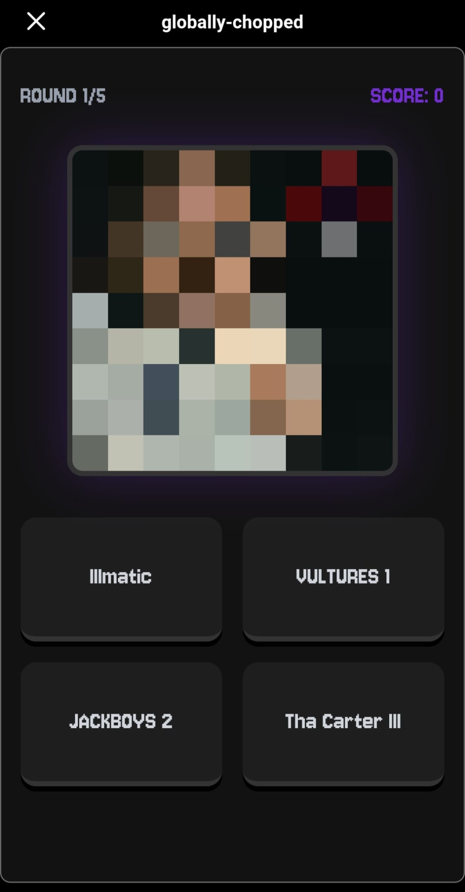

# 🎵 Globally Chopped

## [](https://www.reddit.com/r/globally_chopped_dev/comments/1qhywbm/globallychopped/?utm_source=share&utm_medium=web3x&utm_name=web3xcss&utm_term=1&utm_content=share_button)

A daily music trivia game built on the **Reddit Devvit** platform. Test your hip-hop knowledge by guessing 5 different album covers every day.

## 🖼️ Preview

<p align="center">
  
  
</p>

## 🚀 Features

* **Daily Challenges:** 5 new albums are selected every 24 hours (UTC+3) for the entire community.
* **Curated Archive:** Features a specialized collection of **245 hip-hop albums**.
* **Smart History System:** Implemented global history logic that tracks selected albums to prevent repeats until the entire pool is exhausted.
* **Global Leaderboards:** Compete with other Redditors on the All-Time leaderboard.
* **Reddit Integration:** A seamless Webview experience built directly into the Reddit ecosystem.

## 🛠️ Tech Stack

* **Platform:** [Devvit.js](https://developers.reddit.com/) (Reddit's App Platform).
* **Frontend:** React with Vite.
* **Backend:** Express.js.
* **Database:** Redis (Used for game state, daily album persistence, and non-expiring global history).
* **Language:** TypeScript.

## 📂 Project Structure

* `src/main.ts`: Core server logic, API endpoints, and Redis integration.
* `src/client/`: React frontend application and UI components.
* `src/assets/covers/`: Local storage for the 245 album cover images.
* `src/shared/`: Shared TypeScript interfaces and constants.

## 🔧 Installation & Playtesting

To run this project locally, you must have the [Devvit CLI](https://developers.reddit.com/docs/install_devvit) installed.

1. **Clone the repository:**
   ```bash
   git clone [https://github.com/zeynepsturan/DEVVITGAME-globally-chopped.git](https://github.com/zeynepsturan/DEVVITGAME-globally-chopped.git)
   cd DEVVITGAME-globally-chopped

2.  **Install dependencies:**
    ```bash
    npm install
    ```

3.  **Login to Reddit Devvit:**
    ```bash
    devvit login
    ```

4.  **Start Playtest:**
    ```bash
    devvit playtest <your_subreddit_name>
    ```

## 📝 Technical Implementation

The game ensures a unique daily experience by using a global history key in Redis. Unlike the daily album keys which expire every 48 hours, the `chosen-albums:v4:global` key persists indefinitely. Each day, the server filters the 245-album pool against this history, ensuring no album is repeated until every single one has been played.

---

**Developer:** [zeynepsturan](https://github.com/zeynepsturan)  
